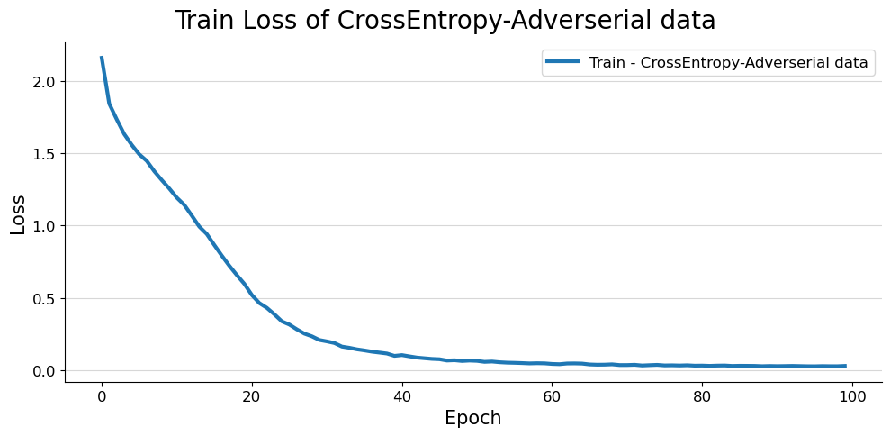

## Introduction
Having a robust classifier is crucial in real-world scenarios where the test data may be corrupted due to noise, distortions, occlusions, or other forms of degradation. A robust classifier ensures that the model can still make accurate predictions despite the presence of corrupted data, improving the reliability of the predictions. 

Corrupted data can pose several challenges in classification tasks, including misclassification, overfitting, reduced robustness, and reduced interpretability. Reliable performance in the presence of corrupted data can be achieved by developing robust classifiers that can handle these challenges effectively, ensuring accurate and reliable classification results in real-world scenarios.

In summary, this project aims to investigate the training of robust classifiers and obtaining robust representations using metric learning loss functions for improved performance in real-world scenarios with corrupted data.

## Requirement
First, you need to install the required dependencies. You can do this by running the following command in your terminal:

```
make requirements
```

This command will automatically install all the necessary libraries and dependencies needed to run the code in this repository. Make sure you have the required libraries installed before proceeding with the next steps.


## Models
The following models are trained for investigating robustness in this repository. 

We apply UMAP (Uniform Manifold Approximation and Projection) on the backbone of the ResNet18 architecture to obtain visualizable representations. This allows us to investigate the robustness of the model
### 1.Cross Entropy (trained on clean data)
This model uses the ResNet-18 architecture and is trained using the cross entropy loss with clean data from the CIFAR-10 dataset.

### 2.Cross Entropy (trained on corrupted data)
This model uses the ResNet-18 architecture and is trained using the cross entropy loss with corrupted data from the CIFAR-10 dataset.

### 3.Angular Loss (trained on clean data) 
This model uses the ResNet-18 architecture and only the backbone (feature extraction) part of the network. It is trained using the angular loss with clean data from the CIFAR-10 dataset.

We utilize a linear layer at the end of the backbone architecture for dimensionality reduction, reducing the dimension from 512 to 128.

The summary of the models that we will be discussing is presented in the table below.
<table style="text-align: center; margin-left: auto; margin-right: auto;">
    <thead>
        <tr>
            <th></th>
            <th style="text-align: center;">Train data</th>
            <th style="text-align: center;">Loss function</th>
        </tr>
    </thead>
    <tbody style="text-align: center; margin-left: auto; margin-right: auto;">
        <tr>
            <td>Model1</td>
            <td style="text-align: center;">Clean Images</td>
            <td style="text-align: center;">Cross Entropy</td> 
        </tr>
        <tr>
            <td>Model2</td>
            <td style="text-align: center;">Corropted Images</td>
            <td style="text-align: center;">Cross Entropy</td> 
        </tr>
        <tr>
            <td>Model3</td>
            <td style="text-align: center;">Clean Images</td>
            <td style="text-align: center;">Angular loss</td> 
        </tr>
    </tbody>
    <tfoot>
        <tr>
            <td colspan="3" style="text-align: center; font-style: italic;">Summary of the models
        </tr>
    </tfoot>
</table>

## Dataset: CIFAR-10
The CIFAR-10 dataset is used for training and evaluating the robust classifier. It consists of 60,000 32x32 color images in 10 classes, with 6,000 images per class. The dataset is divided into 50,000 training images and 10,000 test images.

In this project, we employ two datasets: the original CIFAR-10 dataset and a corrupted CIFAR-10 dataset. To further augment the corrupted dataset, we apply various transformation techniques. In the figure below, we provide visual examples from both datasets for reference.


<table style="text-align: center; margin-left: auto; margin-right: auto;">
	<thead>
		<tr>
			<th style="text-align: center;">Clean Data</th>
			<th style="text-align: center;">Corropted Data</th>
		</tr>
	</thead>
	<tbody style="text-align: center; margin-left: auto; margin-right: auto;">
		<tr>
			<td>
                
			</td>
			<td>
                
			</td>
		</tr>
	</tbody>
</table>


In order to address the heavy computational requirements of the angular loss, we opt to utilize only 20 percent of the default training data as our training data(equivalent to 20 percent of 50k), with the remaining data reserved for validation. To ensure balanced class representation during the split, we adopt an approach that selects an equal proportion of samples from each class for both training and validation sets.

## Training
All three models mentioned above are trained using the CIFAR-10 dataset and different loss functions. 

After installing the required dependencies, for instance, you can run the following command to for training the third model.
```
python train.py resnet_angular
```

## Results
The results of the trained models are evaluated using various metrics, including accuracy and loss. 


<table style="text-align: center margin-left: auto; margin-right: auto; text-align: center" border=0 align=center>
	<thead>
		<tr>
            <th style="text-align: center;">Model</th>
            <th style="text-align: center;">Loss</th>
            <th style="text-align: center;">Accuracy</th>
		</tr>
	</thead>
    <tbody style="text-align: center margin-left: auto; margin-right: auto; text-align: center" border=0 align=center>
        <tr>
            <td>
                Model1
            </td>
            <td>
                
            </td>
            <td>
                
            </td>
        </tr>
        <tr>
            <td>
                Model2
            </td>
            <td>
                
            </td>
            <td>
                
            </td>
        </tr>
        <tr>
            <td>
                Model3
            </td>
            <td>
                
            </td>
            <td>
-
            </td>
        </tr>
        <tr>
        	<td colspan=3>
        		The Model3 is designed for providing representation rather than classification, making it unsuitable for reporting accuracy as a classifier.
        	</td>
        </tr>
    </tbody>
</table>

We apply UMAP (Uniform Manifold Approximation and Projection) on the backbone of the ResNet18 architecture to obtain visualizable representations. This allows us to investigate the robustness of the model

<table style="text-align: center; margin-left: auto; margin-right: auto; text-align: center;" border=0 align=center>
	<thead>
		<tr>
            <th style="text-align: center;">Model</th>
            <th style="text-align: center;">Train Representation</th>
            <th style="text-align: center;">Test Representation</th>
            <th style="text-align: center;">Test Corropted Representation</th>
		</tr>
	</thead>
    <tbody style="text-align: center; margin-left: auto; margin-right: auto; text-align: center;" border=0 align=center>
        <tr>
            <td>
                Model1
            </td>
            <td>
                
            </td>
            <td>
                
            </td>
            <td>
                
            </td>
            </td>
        </tr>
        <tr>
            <td>
                Model2
            </td>
            <td>
                
            </td>
            <td>
                
            </td>
            <td>
                
            </td>
        </tr>
        <tr>
            <td>
                Model3
            </td>
            <td>
                
            </td>
            <td>
                
            </td>
            <td>
                
            </td>
        </tr>
        <tr>
        	<td colspan=4>
UMAP representation
        	</td>
        </tr>
    </tbody>
</table>


## Conclusion

In conclusion, the robust classifier trained with the angular loss on the ResNet-18 backbone demonstrates promising performance in generating resilient representations for the CIFAR-10 dataset, even when trained with clean data. Further investigation can be conducted to evaluate the accuracy of these three models on unseen corrupted data, with the first two models being classifiers and their accuracy being easily measurable. However, for the last model that focuses on representation learning, the accuracy can be assessed using k-nearest neighbors (KNN) and compared with the performance of the previous models. 

The table below compares the accuracy of models on a test dataset with corrupted data. 

<table style="text-align: center; margin-left: auto; margin-right: auto;">
    <thead>
        <tr>
            <th></th>
            <th style="text-align: center;">Accuracy</th>
        </tr>
    </thead>
    <tbody style="text-align: center; margin-left: auto; margin-right: auto;">
        <tr>
            <td>Model1</td>
            <td style="text-align: center;">18.78</td>
        </tr>
        <tr>
            <td>Model2</td>
            <td style="text-align: center;">31.35</td>
        </tr>
        <tr>
            <td>Model3</td>
            <td style="text-align: center;">46</td>
        </tr>
    </tbody>
    <tfoot>
        <tr>
            <td colspan="2" style="text-align: center; font-style: italic;">Accuracy of models on test corropted dataset</td>
        </tr>
    </tfoot>
</table>


This additional evaluation can offer further insights into the robustness and efficacy of the metric learning performance


## References
* https://arxiv.org/abs/1708.01682
* Additionally, a comprehensive Persian report is also included for reference: 
    [Persian report]([./reports/](https://drive.google.com/file/d/10UGtL32dsf_qEv8Rg9pdbFjEcYj6BP8U/view?usp=share_link)) 

